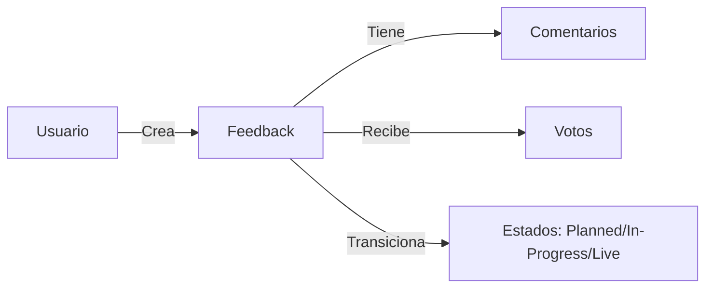
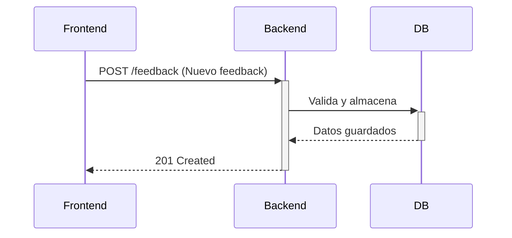

# BicimexBackend - API para Gestión de Feedback 🚴‍♂️💬

[](https://www.django-rest-framework.org/)
[](https://www.python.org/)
[](https://sqlite.org/)

API robusta para el sistema de feedback de productos de ciclismo Bicimex, construida con Django REST Framework y SQLite.

## Características ✨
### Core Features
- 🏗️ **API RESTful** con Django REST Framework
- 📊 **Modelos relacionales** para:
  - Feedback de productos
  - Comentarios anidados
  - Seguimiento de estados (Roadmap)
- ⚡ **Validaciones** a nivel de modelo y serializer

### Específicos del Dominio


## Diagrama de Flujo 🗂️


## Requisitos ⚙️
- Python 3.10+
- pip 22+
- Node.js (para ejecutar tests frontend)
- Git

## Instalación 🛠️

1. **Clonar repositorio**:
```bash
git clone https://github.com/miguel807/BicimexBackend.git
cd BicimexBackend
```

2. **Crear y activar entorno virtual**:
```bash
python -m venv venv
source venv/bin/activate  # Linux/Mac
venv\Scripts\activate    # Windows
```

3. **Instalar dependencias**:
```bash
pip install -r requirements.txt
```

4. **Migraciones**:
```bash
python manage.py migrate
```

## Semilla de Datos 🌱

Ejecutar el siguiente comando para poblar la base de datos con datos iniciales:

```bash
python -m comments.seed_dat
```


## Endpoints 🌐

| Método | Endpoint                | Descripción                      |
|--------|-------------------------|----------------------------------|
| GET    | `/api/feedback/`        | Listar todos los feedbacks       |
| POST   | `/api/feedback/`        | Crear nuevo feedback             |
| GET    | `/api/feedback/{id}/`   | Detalle de feedback              |
| PUT    | `/api/feedback/{id}/`   | Actualizar feedback              |
| DELETE | `/api/feedback/{id}/`   | Eliminar feedback                |
| POST   | `/api/comments/`        | Añadir comentario                |
